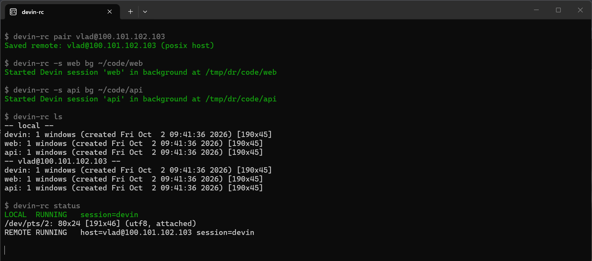

# devin-rc

A tiny remote-control wrapper for Devin CLI.

It does **not** clone or hand off the Devin session. Devin runs on the main PC inside `tmux`; your laptop attaches to that same pseudo-terminal over Tailscale SSH.



## Requirements

- Main PC: macOS or Linux, Devin CLI, Tailscale
- Laptop: macOS or Linux, Tailscale + SSH
- iPhone: iOS with Tailscale + an SSH app (Blink Shell, Termius, or iSH)
- All devices signed into the same Tailscale network

On macOS, `setup-host` installs tmux via Homebrew and requires the **standalone** Tailscale build (`brew install tailscale` or the package from tailscale.com) — the App Store app does not include the SSH server.

## 1. Install on both machines

Copy this folder to each machine, then:

```bash
./install.sh
exec "$SHELL" -l
```

## 2. Main PC: one-time host setup

```bash
devin-rc setup-host
```

That checks Devin/tmux/Tailscale, installs `tmux` if needed, enables Tailscale SSH, and prints something like:

```text
vlad@100.101.102.103
```

## 3. Main PC: launch Devin remote-ready

From a project:

```bash
cd ~/code/my-project
devin-rc start
```

Or:

```bash
devin-rc start ~/code/my-project
```

You now use Devin normally. To leave it running and return to your shell:

```text
Ctrl-b, then d
```

## 4. Laptop: pair once

Use the target printed by `setup-host`:

```bash
devin-rc pair vlad@100.101.102.103
```

## 5. Laptop: connect

```bash
devin-rc connect
```

You are now attached to the **same tmux pane and same Devin CLI process** running on the main PC.

You can keep both the main-PC terminal and laptop attached simultaneously. Anything typed/output in one is visible in the other.

## Commands

```text
devin-rc setup-host
devin-rc start [project]
devin-rc bg [project]
devin-rc connect [user@host]
devin-rc pair user@host [--wsl] [--distro NAME]
devin-rc status          # local + remote state
devin-rc ls              # list local + remote tmux sessions
devin-rc stop
devin-rc iphone          # iPhone (iOS) connect instructions + command
devin-rc ui              # interactive shell with /slash commands
devin-rc info
devin-rc version
```

`pair` also accepts a bare `HOST` (SSH then uses your local username). `--wsl`
is for hosts running Devin in WSL on Windows; `--distro` names the host's WSL
distro (default: the host's default distro).

Multiple concurrent sessions are supported via `-s`/`--session` (placed before
the command) or the `SESSION` environment variable. Session names are limited
to letters, digits, `-` and `_` (tmux forbids `.` and `:`):

```bash
devin-rc -s web bg ~/code/web
devin-rc -s api bg ~/code/api
devin-rc -s web connect
```

`DEVIN_CMD` may include arguments (e.g. `DEVIN_CMD="devin --model x"`), and is
persisted by `setup-host`/`pair` in `~/.config/devin-rc/config`. The `SESSION`,
`REMOTE`, and `DEVIN_CMD` environment variables override the saved config.

## Interactive shell

`devin-rc ui` opens a small interactive shell whose prompt shows the active
session. Commands are slash commands mirroring the regular ones (plain words
work too):

```text
devin-rc:web> /pair vlad@100.101.102.103
devin-rc:web> /status
devin-rc:web> /session api      # switch active session
devin-rc:api> /connect          # attach; Ctrl-b d detaches back to the prompt
devin-rc:api> /quit
```

`/help` lists everything (`/status`, `/ls`, `/connect`, `/start`, `/bg`,
`/stop`, `/pair`, `/session`, `/info`, `/iphone`, `/quit`). Errors inside the
shell return to the prompt instead of exiting, and detaching from a
`/connect`ed terminal drops you back into the shell rather than closing it.

## Windows

Native Windows support is a PowerShell port (`devin-rc.ps1`, works in Windows PowerShell 5.1 and PowerShell 7) with the same commands.

```powershell
.\install.ps1            # per-user install, adds devin-rc to your user PATH (no admin); -NoPath to skip, -Prefix to relocate
devin-rc help
.\uninstall.ps1          # -Purge also removes the saved config
```

Installing also drops a `devin-rc.cmd` shim (cmd/PowerShell) and a `devin-rc` shim for Git Bash.

| Role on Windows | How it works | Needs |
|---|---|---|
| **Laptop (client)**: `pair`, `connect`, `status`, `ls` | Windows OpenSSH client (`ssh.exe`) over Tailscale | Tailscale for Windows signed in; OpenSSH Client (installed by default on Windows 11) |
| **Main PC (host)**: `setup-host`, `start`, `bg`, `stop` | Devin runs in `tmux` inside **WSL2** (tmux has no native Windows build) | A working WSL distro with tmux and the **Linux** Devin CLI inside it |

Windows-specific notes:

- Pairing with a Windows host: `devin-rc pair user@HOST --wsl` (the client then attaches through `wsl.exe -e tmux ...`; add `--distro NAME` if the host uses a non-default WSL distro). Pairing with a Linux or macOS host needs no flag.
- **Tailscale SSH cannot host on Windows**, so a Windows host needs the Windows OpenSSH Server. `setup-host` checks WSL, tmux, Devin and Tailscale and prints the elevated PowerShell commands for the OpenSSH Server and a firewall rule limited to the Tailscale range; it does not change system settings itself.
- Multiple WSL distros: set `DEVIN_RC_DISTRO`. Config lives in `%APPDATA%\devin-rc\config.json` (override with `DEVIN_RC_HOME`).
- The bash version also works as a client under Git Bash, including `pair --wsl`; its `setup-host` stops with a pointer to the PowerShell version.
- The client side was tested on Windows 11 (PowerShell 7 and 5.1, the cmd and Git Bash shims, install and uninstall). The host side (WSL) is the less tested path: if `wsl -l -v` shows a distro that does not start, repair or reinstall it first.

## iPhone

The iPhone is a client like the laptop — attach over Tailscale + SSH:

1. Install **Tailscale** (App Store) and sign in to the same tailnet.
2. Install an SSH app. **Blink Shell** is the best tmux client (real Ctrl key on the shortcut bar); Termius and the free iSH emulator also work.
3. Run `devin-rc iphone` on a paired machine (or check `devin-rc info`) — it prints the exact SSH command plus an iOS **Shortcuts** recipe for one-tap connects. It boils down to:

   ```bash
   ssh -t vlad@100.101.102.103 "tmux has-session -t devin 2>/dev/null && exec tmux attach-session -t devin"
   ```

   (the real printed command also reports "not running" if the host session is down, and targets the session from `-s`/`SESSION`; for a Windows host it is the `wsl.exe ... tmux attach` variant).

iSH can even run the full bash client: `apk add openssh-client`, then `devin-rc pair` / `devin-rc connect` work as usual.

## Important limitation

A Devin CLI process that was already launched in a normal terminal **before** `devin-rc` cannot be safely and portably pulled into tmux after the fact. Exit that one once, then launch future sessions with `devin-rc start`.

## Security model

There is no public web terminal and no custom password server. Connectivity is through Tailscale, and SSH access is governed by your tailnet's Tailscale SSH policy.
